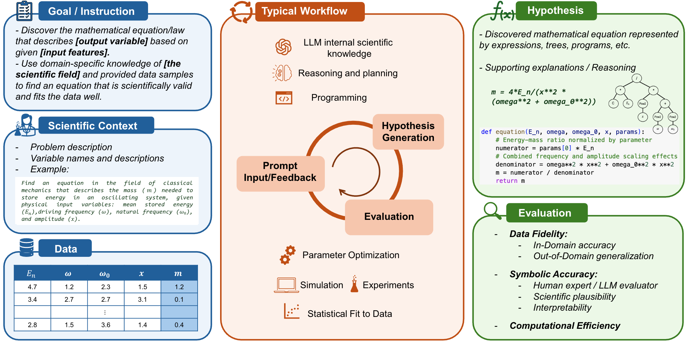

# `LLM-SRBench`: Benchmark for Scientific Equation Discovery or Symbolic Regression with LLMs

This is the official repository for the paper "LLM-SRBench: A New Benchmark for Scientific Equation Discovery with Large Language Models"

[](https://arxiv.org/abs/2504.10415)
[](https://huggingface.co/datasets/nnheui/llm-srbench)


## Overview
In this paper, we introduce **LLM-SRBench**, a comprehensive benchmark with $239$ challenging problems across four scientific domains specifically designed to **evaluate LLM-based scientific equation discovery methods** while preventing trivial memorization.
Our benchmark comprises two main categories: **LSR-Transform**, which transforms common physical models into less common mathematical representations to test reasoning beyond memorized forms,
and **LSR-Synth**, which introduces synthetic, discovery-driven problems requiring data-driven reasoning.




## Updates

* **14 Apr, 2025**: Primary release of benchmark and evaluation code

## Get Started

### Installation

To run the code, create a conda environment and install the dependencies provided in the `requirements.txt` or `environment.yml`:

```
conda create -n llmsrbench python=3.11.7
conda activate llmsrbench
pip install -r requirements.txt
```

Note: Requires Python ≥ 3.9

You also need to install other packages for each search method from their original github repositories.
  - [llmsr](https://github.com/deep-symbolic-mathematics/LLM-SR)
  - [lasr](https://github.com/trishullab/LibraryAugmentedSymbolicRegression.jl)
  - [sga](https://github.com/PingchuanMa/SGA)


### Datasets

The data for the benchmark will be automatically downloaded from [huggingface](https://huggingface.co/datasets/nnheui/llm-srbench).

### Supported methods

We provide implementation for [LLMSR](https://github.com/deep-symbolic-mathematics/LLM-SR), [LaSR](https://github.com/trishullab/LibraryAugmentedSymbolicRegression.jl), [SGA](https://github.com/PingchuanMa/SGA) in the `methods/` folder.

In order to include a new method, please refer to the implementation section for detailed instructions on how to add a new discovery method to the project. This includes setting up the necessary configurations, implementing the searcher class, and ensuring compatibility with the existing framework.

### How to run
1. Activate the appropriate conda environment.
2. Launch a local LLM server. While our implementation utilizes `vllm`, you can also opt for other libraries as long as you implement the necessary functionality in the searcher class. For example, to start the server with the vllm library, use the command:

```
vllm serve meta-llama/Llama-3.1-8B-Instruct --dtype auto --api-key token-abc123 --port 10005
```

3. Configure the environment variables in the `.env` file. Duplicate `.env.example` to `.env` and specify the following:
   - `VLLM_API_KEY`: Your API key for the local vLLM server (e.g., 'token-abc123').
   - `OPENAI_API_KEY`: Your OpenAI API key if you are utilizing OpenAI models.
   - `SGA_PYTHON_PATH`: The path to the Python executable in your SGA conda environment if you are using the SGA searcher.

4. Execute the [eval.py](./eval.py) script with the required arguments:
   - `--searcher_config`: Path to the YAML configuration file for the searcher (mandatory).
   - `--dataset`: The name of the dataset to evaluate (mandatory).
   - `--resume_from`: The path to a previous run directory to continue from (optional).
   - `--problem_name`: The specific problem name to evaluate (optional).
   - `--local_llm_port`: The port number for the local LLM server (optional).

   Available dataset options include:
   * `lsrtransform` (lsr-transform)
   * `matsci` (lsr-synth)
   * `chem_react` (lsr-synth)
   * `phys_osc` (lsr-synth)
   * `bio_pop_growth` (lsr-synth)
  
For example, for running `llmsr` method on the `lsrtransform` dataset with open LLM backbone `llama31_8b` on local server, you can use the following command:

```
python eval.py --dataset lsrtransform --searcher_config configs/llmsr_llama31_8b.yaml --local_llm_port 10005
```

More evaluation scripts for running discovery methods with different LLM backbones on different datasets are provided in `example_script.sh`. 

The execution of [eval.py](./eval.py) will generate log files in the `logs/` folder. You can resume your run using the `--resume_from <log_dir>` option. For instance, 
`--resume_from logs/MatSci/llmsr_4_10_10/01-16-2025_17-41-04-540953` will bypass already completed equations.


### Project Structure
The working directory structure will be as follows:

```
project
│   README.md
|   eval.py
|   .env
└───bench/
|
└───methods/
|   └───direct
|   └───llmsr
|   └───lasr
|   └───sga_sr
|
└───datasets/
|
└───logs/
    └───<dataset-name>
        └───<method-name>
            └───<date>
```


## Implementing a new searcher

To implement a new searcher, you must create a class that inherits from the base class `BaseSearcher`. This base class provides the foundational structure for your LLM-based searcher, including essential methods that need to be overridden.

```python
class BaseSearcher:
    def __init__(self, name) -> None:
        self._name = name

    def discover(self, task: SEDTask) -> List[SearchResult]:
        '''
        Return:
            List of SearchResult
        '''
        raise NotImplementedError

    def __str__(self):
        return self._name
```

The input `task` will provide a description of the target equation, input variables, and training data points.

An example of a searcher is
```python
class DirectPromptingSearcher(BaseSearcher):
    def __init__(self, name, num_sample, api_type, api_model, api_url):
        super().__init__(name)
        self.num_samples = num_samples
        self.llm = LLM(api_type, api_model, api_url)

    def discover(self, task: SEDTask):
        dataset = task.samples
        symbol_descs = task.symbol_descs

        prompt = f"Find the mathematical function skeleton that represents {symbol_descs[0]}, given data on {", ".join(symbol_descs[1:-1]) + ", and " + symbol_descs[-1]}"
        
        best_program, best_score = None, -np.inf
        for _ in range(self.num_samples):
            program_str, aux = self.llm.sample_program(prompt)
            score = evaluate(program_str, dataset)
            if score > best_score:
                best_program = program_str

        best_equation = Equation(
            symbols=info["symbols"],
            symbol_descs=info["symbol_descs"],
            symbol_properties=info["symbol_properties"],
            expression=None,
            program_format = best_program,
            lambda_format = programstr2lambda(best_program)
        )

        return [
            SearchResult(
                equation=best_equation,
                aux=aux
            )
        ]
```

Once you’ve implemented your searcher, create a corresponding configuration file in the `configs/` folder. For example:

```yaml
name: DirectPrompting-Llama31_8b
class_name: DirectPromptingSearcher
api_type: "vllm"
api_model: "meta-llama/Llama-3.1-8B-Instruct"
api_url: "http://localhost:{}/v1/"
num_samples: 1000
```

To evaluate with this searcher, run `eval.py` and provide the path to its configuration file; this will load the settings and initiate the evaluation process on the specified dataset.

## Citation
Read our [paper](.) for more information about the benchmark (or contact us ☺️). If you find our code and data helpful, please cite us with

<pre>
@misc{llmsrbench,
      title={LLM-SRBench: A New Benchmark for Scientific Equation Discovery with Large Language Models}, 
      author={Parshin Shojaee and Ngoc-Hieu Nguyen and Kazem Meidani and Amir Barati Farimani and Khoa D Doan and Chandan K Reddy},
      year={2025},
      eprint={2504.10415},
      archivePrefix={arXiv},
      primaryClass={cs.CL},
      url={https://arxiv.org/abs/2504.10415}, 
}
</pre>

## License

This repository is licensed under MIT licence.

This work is built on top of other open source projects, including [LLM-SR](https://github.com/deep-symbolic-mathematics/llm-sr), [LaSR](https://github.com/trishullab/LibraryAugmentedSymbolicRegression.jl), [SGA](https://github.com/PingchuanMa/SGA), and [PySR](https://github.com/MilesCranmer/PySR), and is inspired by the effort behind [srbench](https://github.com/cavalab/srbench). We thank the original contributors of these works for open-sourcing their valuable source codes. 


## Contact Us

For any questions or issues, you are welcome to open an issue in this repo, or contact us at parshinshojaee@vt.edu and ngochieutb13@gmail.com .
